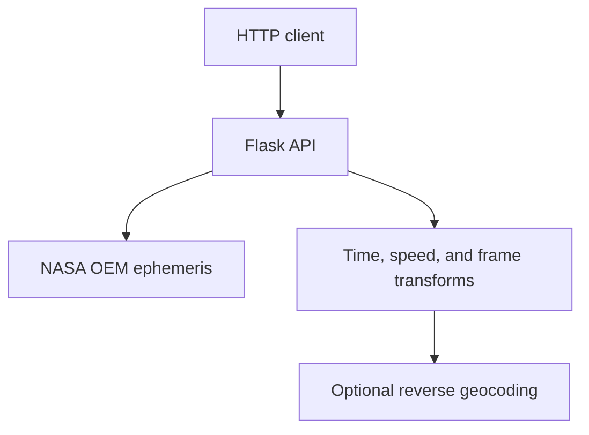

# ISS Orbital Data Tracker API

A small Flask API that retrieves NASA's current International Space Station OEM ephemeris, exposes the source metadata and state vectors, and derives speed and Earth-relative location for a requested epoch.

The project demonstrates API design, XML-to-JSON processing, orbital state-vector calculations, reference-frame conversion with Astropy, deterministic testing, and containerized deployment.

## Architecture



NASA's OEM document is downloaded when a data-backed endpoint is requested. Pure transformation functions handle epoch matching, velocity magnitude, pagination, and GCRS-to-ITRS/geodetic conversion. Reverse geocoding is deliberately optional: coordinate results remain useful if that external service is unavailable.

## Quick start

Requirements: Python 3.11 or 3.12.

```bash
python -m venv .venv
source .venv/bin/activate          # Windows PowerShell: .venv\Scripts\Activate.ps1
python -m pip install -r requirements-dev.txt
python -m pytest -q
python iss_tracker.py
```

The API will be available at `http://127.0.0.1:5000`. Confirm it without contacting the upstream data service:

```bash
curl http://127.0.0.1:5000/health
```

### Docker

```bash
docker compose up --build -d
curl http://localhost:5000/health
docker compose down
```

The repository builds its own image. An old course image may still exist on Docker Hub, but it is not the reproducible source for the current code.

## API

| Route | Result |
|---|---|
| `GET /health` | Local liveness response; does not call NASA |
| `GET /header` | OEM document header |
| `GET /metadata` | OEM segment metadata |
| `GET /comment` | OEM data comments |
| `GET /epochs` | State vectors; accepts nonnegative `offset` and `limit` query parameters |
| `GET /epochs/<epoch>` | State vector nearest to the requested OEM epoch |
| `GET /epochs/<epoch>/speed` | Velocity magnitude in km/s |
| `GET /epochs/<epoch>/location` | Latitude, longitude, altitude, and optional reverse-geocoded address |
| `GET /now` | State vector nearest to current UTC time, plus derived speed and location |

Epoch path parameters use year/day-of-year timestamps such as `2026-221T12:30:00.000Z`.

Examples:

```bash
curl 'http://localhost:5000/epochs?offset=0&limit=2'
curl 'http://localhost:5000/epochs/2026-221T12:30:00.000Z/speed'
```

## Verification

The test suite is deterministic: it uses fixed OEM-shaped fixtures and Flask's test client, with network and geocoding boundaries replaced during API tests. CI also enforces Ruff linting and formatting.

```bash
python -m pytest -q
```

GitHub Actions runs the suite on Python 3.11 and 3.12 and independently verifies that the Docker image builds.

## Data and assumptions

- Source: [NASA public ISS OEM ephemeris](https://nasa-public-data.s3.amazonaws.com/iss-coords/current/ISS_OEM/ISS.OEM_J2K_EPH.xml).
- Position and velocity components are interpreted using the units supplied by the OEM state vectors.
- The nearest-epoch lookup compares complete UTC timestamps, not only minute fields.
- Astropy converts the GCRS position to ITRS before geodetic latitude, longitude, and altitude are reported.
- Reverse-geocoded place names come from OpenStreetMap's Nominatim service and may be absent over oceans or during service failures.
- This is an educational data service, not flight software or an operational navigation product.

## Project history

This began as an individual university software-engineering project in 2024. The original API and calculations were authored by Nicholas Babineaux; the repository was later hardened as a portfolio project with deterministic tests, explicit failure handling, modern container instructions, and documentation of its assumptions and limits.
